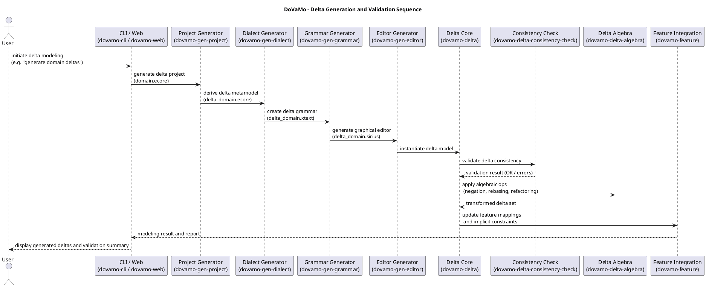
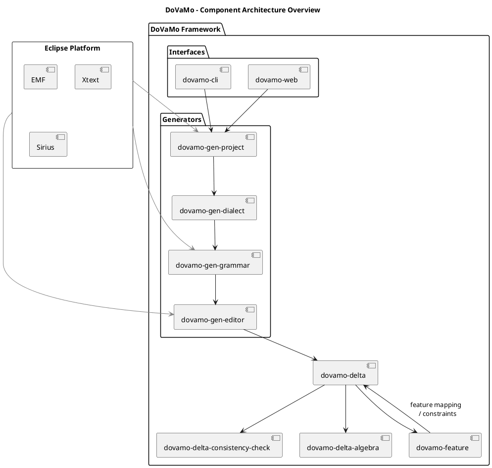

# 🧩 DoVaMo Architecture Overview

This document provides a visual overview of the **DoVaMo framework** architecture,
including its workflow and component organization.

---

## Delta Generation & Validation Sequence

The following sequence diagram illustrates the main interactions
between DoVaMo modules during a typical delta modeling workflow.



**Legend**
- **User / CLI / Web** – Entry points to trigger delta processing  
- **Generators** – Create dialects, grammars, editors, and projects  
- **Core Modules** – Delta definition, consistency checks, and algebraic transformations  
- **Feature Integration** – Manages variability and feature mappings  

---

## Component Architecture

The component diagram below shows how DoVaMo modules are organized and depend on each other.



**Layers**
1. **Core Layer** – Delta metamodel, algebra, and consistency checking  
2. **Feature Layer** – Integrates problem/solution feature models  
3. **Generator Layer** – Creates delta-based tooling (dialect, grammar, editor, project)  
4. **Interface Layer** – Provides CLI and Web access  
5. **Eclipse Platform Dependencies** – EMF, Xtext, Sirius support  

---

## Notes

- All `.puml` sources are located in `docs/plantuml` for transparency.  
- You can regenerate the diagrams using:
  ```bash
  plantuml -tpng docs/plantuml/*.puml
  ```